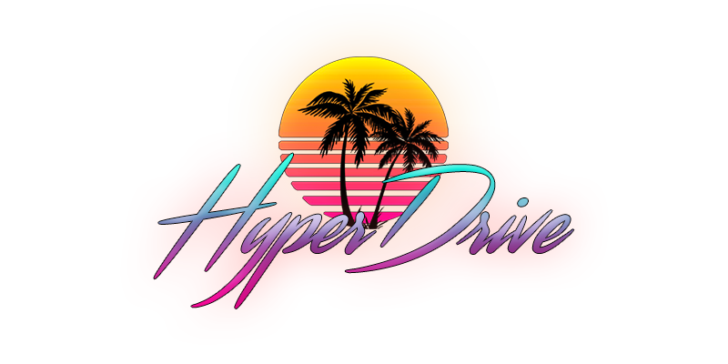

---

HyperDrive is a first-person environment, in which the user drives down an infinite stretch of road listening to retrowave music. The whole project is built around [Three.js](https://threejs.org/), a lightweight 3D JavaScript library with a WebGL renderer.

## Controls

Users may click anywhere on the scene to lock their pointer and pan the camera around. At any time, the user can hit their `Esc` key to remove the lock. In the bottom-righthand corner, there are two buttons that play/pause music in the envionment or toggle the volume of the music.
